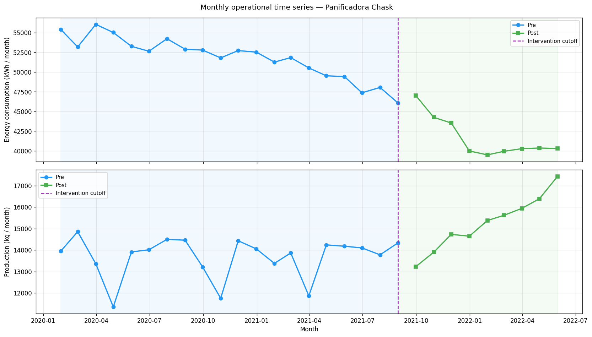

# Panificadora Chask — Plant Modernization

> End-to-end engineering and data project documenting the plant modernization
> and energy optimization of an industrial bakery in Bolivia — from field
> diagnosis through reproducible data pipeline, statistical inference,
> scenario-based ROI, interactive dashboard, and documentation site.

[](https://github.com/anthoadc-AI/chask-plant-modernization/actions/workflows/ci.yml)
[](https://anthoadc-AI.github.io/chask-plant-modernization/)
[](https://github.com/anthoadc-AI/chask-plant-modernization/releases)
[](LICENSE)
[](pyproject.toml)

**📊 Live Dashboard**: `<STREAMLIT_URL>` *(deploy via [dashboard/README.md](dashboard/README.md))*  
**📚 Documentation**: [anthoadc-AI.github.io/chask-plant-modernization](https://anthoadc-AI.github.io/chask-plant-modernization/)  
**📋 Case study**: [CASE_STUDY.md](CASE_STUDY.md)  
**📔 Notebooks**: [`notebooks/`](notebooks/)

---

## Project at a Glance

**Client**: Panificadora Chask &nbsp;·&nbsp; **Firm**: INGEDAV S.R.L. &nbsp;·&nbsp;
**Location**: Punata, Cochabamba, Bolivia  
**Period**: Dec 21, 2020 – Jun 4, 2022 &nbsp;·&nbsp; **Investment**: USD 85,000 &nbsp;·&nbsp;
**Intervention cutoff**: Aug 2021

All 7 headline metrics improved after the August 2021 intervention:

| Metric | Pre (n=20) | Post (n=9) | Change |
|---|---|---|---|
| Energy consumption (kWh/mo) | 51,827 | 41,689 | **−19.6%** |
| Energy intensity (kWh/kg) | 3.81 | 2.76 | **−27.5%** |
| Gross margin | 21.4% | 29.0% | **+7.5 pp** |
| Sales (USD/mo) | 20,756 | 23,100 | **+11.3%** |
| Machine failures/month | 8.1 | 4.3 | **−46.2%** |
| Downtime (h/month) | 26.9 | 15.7 | **−41.7%** |
| Production (kg/mo) | 13,680 | 15,249 | **+11.5%** |

> **Honest framing**: Post averages include the Sep–Oct 2021 commissioning spike
> (failures: 10, 9). Steady-state (Dec 2021–May 2022, n=6): energy 40,062 kWh/mo
> (**−22.7%**), MTBF 88.7 h → 316.1 h (**+256%**).

**ROI — USD 85,000 investment · 10% discount rate · 5-year horizon**:

| Scenario | Annual Benefit | Payback | NPV (5yr) |
|---|---|---|---|
| Conservative (energy + downtime only) | $11,230 | 7.6 yr | **−$42,430** |
| Base (+ observed production growth) | $19,490 | 4.4 yr | **−$11,116** |
| Optimistic (+ capacity utilization ramp) | $28,741 | 1.8 yr | **+$69,618** |

> **Data disclosure**: The monthly dataset (29 observations, Jan 2020 – May 2022) is a
> documented reconstruction calibrated to the engineering report metrics; original client
> records are confidential. See [docs/data-dictionary.md](docs/data-dictionary.md).

---

## Featured Figure



*Monthly energy consumption and intensity. Vertical line = Aug 2021 intervention cutoff.
Sep–Oct 2021 commissioning spike is visible and expected.*

---

## What This Repository Demonstrates

| Competency | Evidence |
|---|---|
| **Project Management** | Charter, WBS, Gantt, 10-risk register, cost baseline — `project-management/` |
| **Data Engineering** | Medallion pipeline (raw → staging → analytics), Pandera schema validation, reproducible synthetic daily dataset |
| **Statistical Analysis** | EDA, Z-score + Isolation Forest anomaly detection, Mann-Whitney / Welch's t-tests (7/7 significant, large Cohen's d), Interrupted Time Series regression |
| **Energy Efficiency** | Motor fleet model (IE1→IE3, IEC 60034-30-1), theoretical/observed reconciliation, CO₂ avoidance, 3-scenario ROI with honest negative NPV |
| **Software Craftsmanship** | `src`-layout Python package, ruff, 230+ tests, CI matrix (Python 3.10/3.11/3.12), Streamlit dashboard, MkDocs Material site |

---

## Repository Structure

```
chask-plant-modernization/
├── .github/workflows/      # CI (Python matrix) + docs deploy (GitHub Pages)
├── dashboard/              # Streamlit multipagina app — 6 pages
│   └── pages/              # overview · energy · statistics · reliability · ROI · PM
├── data/
│   ├── raw/                # monthly_reconstructed.csv (29 rows, seed=42)
│   ├── staging/            # Pandera-validated copy
│   └── analytics/          # Enriched KPIs + daily_synthetic.csv
├── docs/                   # MkDocs source (data dict, findings, energy analysis, PM, about)
├── notebooks/              # Jupyter notebooks (EDA + energy/process)
├── project-management/     # Charter, WBS, schedule (Gantt), risk register, cost baseline
├── reports/figures/        # 10 static PNGs + 5 interactive HTML figures
├── src/chask/              # Python package — all analysis logic
│   ├── datagen/            # Reproducible dataset generation
│   ├── pipeline/           # ingest → validate → transform
│   ├── analysis/           # EDA, anomaly detection, stats, viz
│   ├── energy/             # KPIs, motor savings model, load profile, ROI
│   └── process/            # Throughput and reliability metrics
└── tests/                  # 230 pytest unit tests
```

---

## Quickstart

Requires Python >= 3.10.

```bash
git clone https://github.com/anthoadc-AI/chask-plant-modernization.git
cd chask-plant-modernization
make install        # pip install -e ".[dev]"
make pipeline       # run data pipeline (ingest → validate → transform)
make test           # run 230+ tests
make figures        # generate all analysis figures
make energy         # run energy & process analysis
make dashboard      # launch Streamlit dashboard (localhost:8501)
make docs-build     # build MkDocs site with strict validation
```

---

## How to Navigate

**Recruiter / hiring manager** — Start with [CASE_STUDY.md](CASE_STUDY.md) for the
project narrative, then the [documentation site](https://anthoadc-AI.github.io/chask-plant-modernization/).
The dashboard gives interactive access to all results.

**Data scientist** — Browse [`notebooks/`](notebooks/) and
[`src/chask/analysis/`](src/chask/analysis/) for statistical methods.
[`docs/findings.md`](docs/findings.md) summarizes hypothesis test results.

**Software / ML engineer** — See [`src/chask/`](src/chask/) for package architecture,
[`tests/`](tests/) for test coverage patterns, and [`.github/workflows/`](.github/workflows/)
for the CI pipeline.

---

## Author

**Anthony Dávila** — Mechanical Engineer | Data Engineer | Python · SQL · Energy Analytics  
Founder & CEO, INDA LLC · Cochabamba, Bolivia (relocating to Houston, TX)

[](https://linkedin.com/in/anthony-davila-034b921ba)
[](https://github.com/anthoadc-AI)

---

*Dataset is a documented reconstruction calibrated to real project outcomes;
original client records are confidential. See [data dictionary](docs/data-dictionary.md).*
