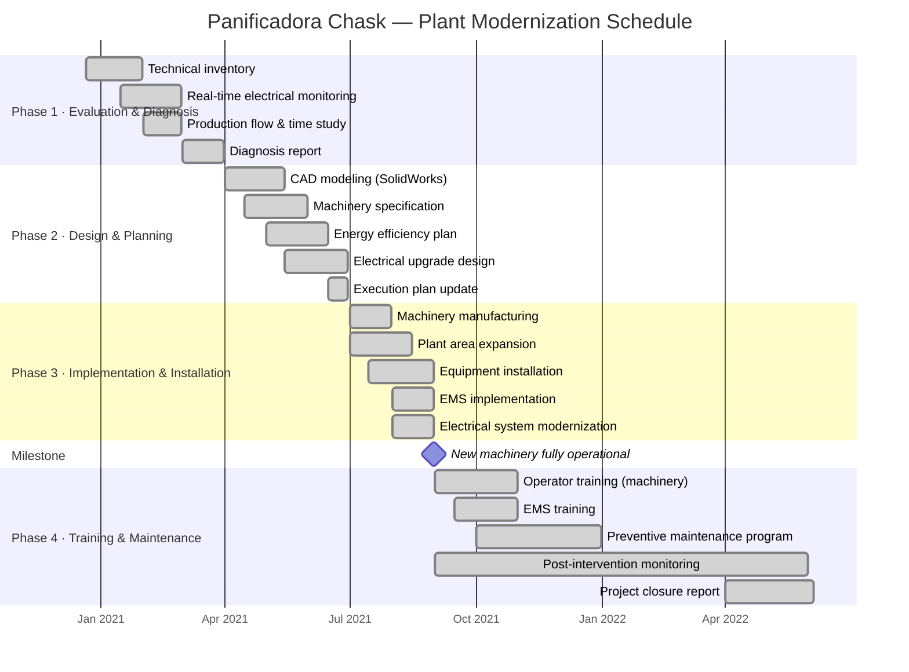

# Project Schedule — Panificadora Chask

**Project**: Plant Expansion and Resource Optimization  
**Executing firm**: INGEDAV S.R.L. | **Director**: Anthony Davila  
**Period**: December 21, 2020 – June 4, 2022

---

## Gantt Chart

---

## Phase Timeline Summary

| Phase | Start | End | Duration |
|---|---|---|---|
| 1 — Evaluation & Diagnosis | Dec 21, 2020 | Mar 31, 2021 | ~3.5 months |
| 2 — Design & Planning | Apr 1, 2021 | Jun 30, 2021 | ~3 months |
| 3 — Implementation & Installation | Jul 1, 2021 | Aug 31, 2021 | ~2 months |
| 4 — Training & Preventive Maintenance | Sep 1, 2021 | Jun 4, 2022 | ~9 months |
| **Total project** | **Dec 21, 2020** | **Jun 4, 2022** | **~17.5 months** |

---

## Key Milestones

| Milestone | Date | Significance |
|---|---|---|
| Project kickoff | Dec 21, 2020 | Contract signed; work begins |
| Diagnosis report delivered | Mar 31, 2021 | Baseline for design decisions |
| Design freeze | Jun 30, 2021 | All specifications approved; procurement begins |
| **New machinery fully operational** | **Aug 31, 2021** | **Pre/Post analysis cutoff** |
| Maintenance program established | Dec 31, 2021 | Ongoing operations handed to client staff |
| Project closure | Jun 4, 2022 | Final report delivered; contract fulfilled |

---

## Data Collection Coverage

The monthly operational dataset covers January 2020 – May 2022 (29 observations):

- **Pre-intervention period**: Jan 2020 – Aug 2021 (n = 20 months)
- **Post-intervention period**: Sep 2021 – May 2022 (n = 9 months)

The post-intervention period includes the commissioning and stabilization phase of
new machinery, which explains elevated machine failure counts and slight production
dips in the early post months. Steady-state performance is documented separately
in the field engineering report.
